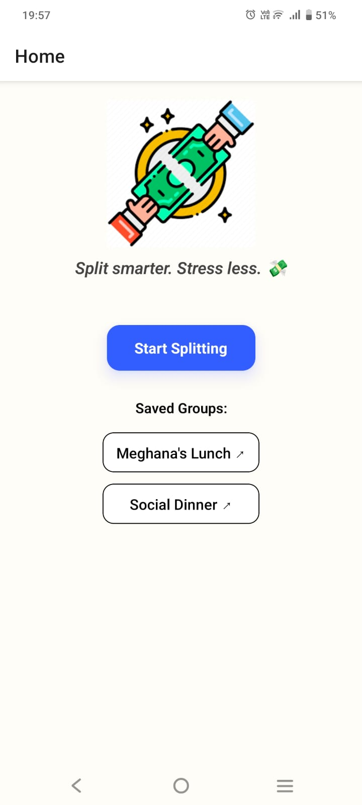
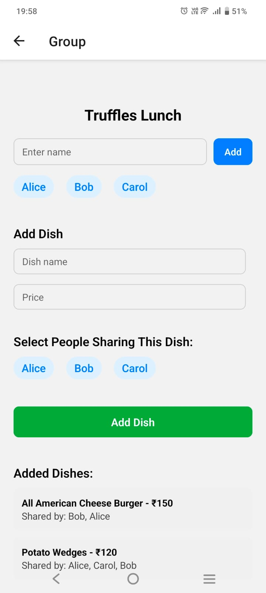
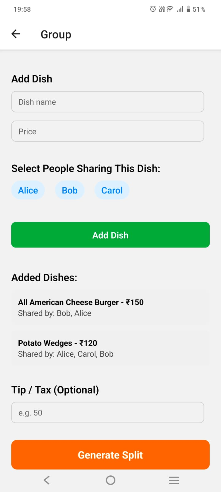
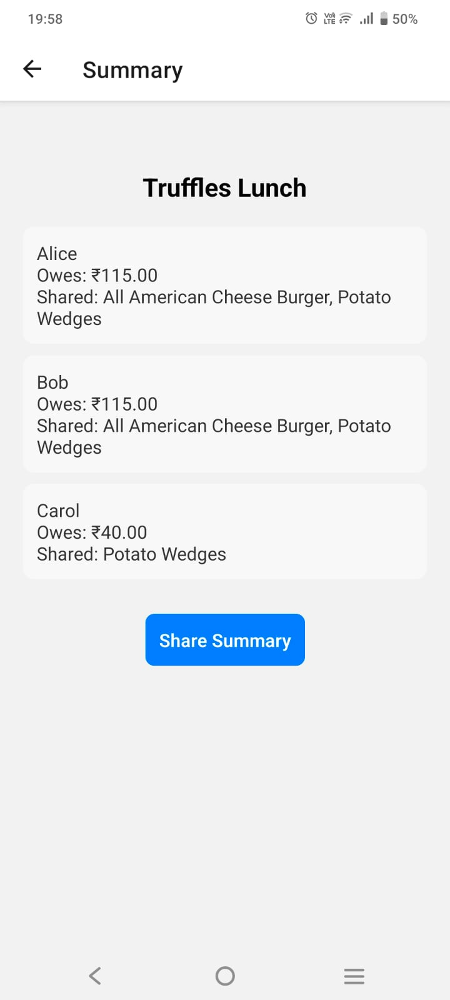

# 🍽️ QuickSplit – Bill Splitting Made Easy

**QuickSplit** is a cross-platform mobile app built with **React Native** and **Expo** that simplifies the process of splitting restaurant bills among groups. Designed for both casual and group dining, it allows users to input individual dishes, share costs, add tips/taxes, and generate clean per-person summaries for instant sharing.

---

## 🚀 Features

- 📋 **Group-based Bill Splitting** – Create a group with names of participants and dishes ordered.
- 🍝 **Per-Dish Assignment** – Assign specific people to each dish for accurate cost division.
- 🧾 **Tip & Tax Support** – Add optional tip or tax to the total bill.
- 📊 **Summary Generation** – See a detailed breakdown of:
  - Total amount paid by each person.
  - Shared items per person.
  - How the bill was split.
- 💾 **Persistent Storage** – All groups and splits are stored using AsyncStorage.
- 🗃️ **Group History** – Reopen, edit, or delete previous splits.
- 📤 **Shareable Summary** – Share the final split via WhatsApp, Email, etc.
- 🎨 **Minimal & Responsive UI** – Built with clarity and simplicity in mind.

---

## 📸 Screenshots




---

## 🛠️ Tech Stack

- **Frontend:** React Native (via Expo)
- **Storage:** AsyncStorage (local persistent storage)

---

## 📦 Installation

### Prerequisites

- [Node.js](https://nodejs.org/)
- [Expo CLI](https://docs.expo.dev/get-started/installation/)
- A mobile device/emulator with Expo Go app

### Steps

```bash
git clone https://github.com/zeal-2004/bill-splitter-app.git
cd bill-splitter-app
npm install
npx expo start

Scan the QR provided in the Expo Go App and start Testing!
```

## 📱 Try the App Instantly

1. Download the **Expo Go** app from the Play Store or App Store.
2. Open the app and enter the following URL: exp://u.expo.dev/update/598f6b5d-fa50-4a74-b83f-07fee1e4be8f
3. Tap **Connect** to start using QuickSplit!